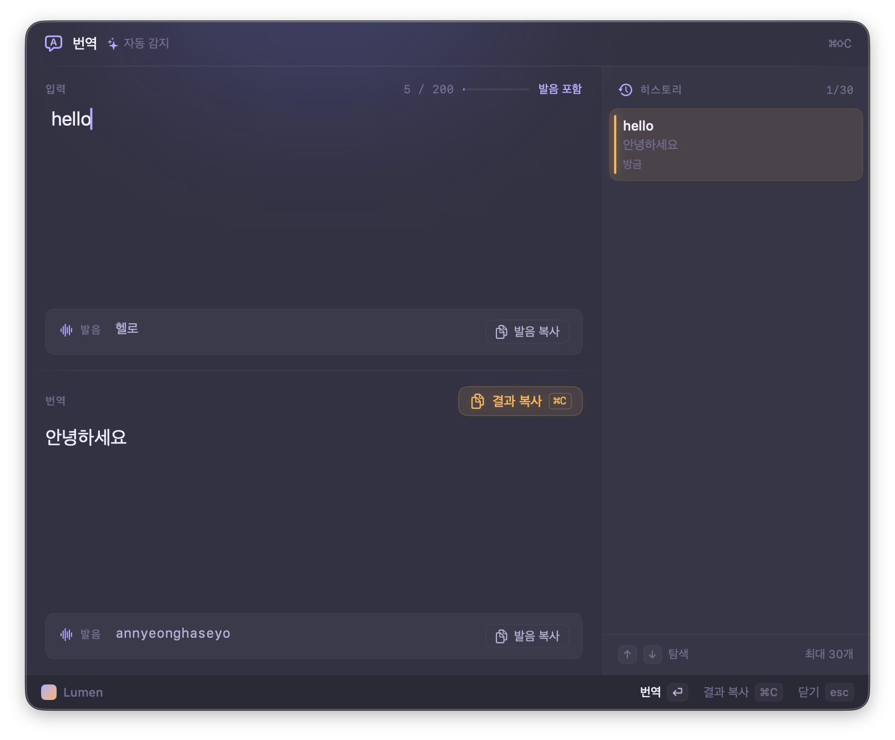
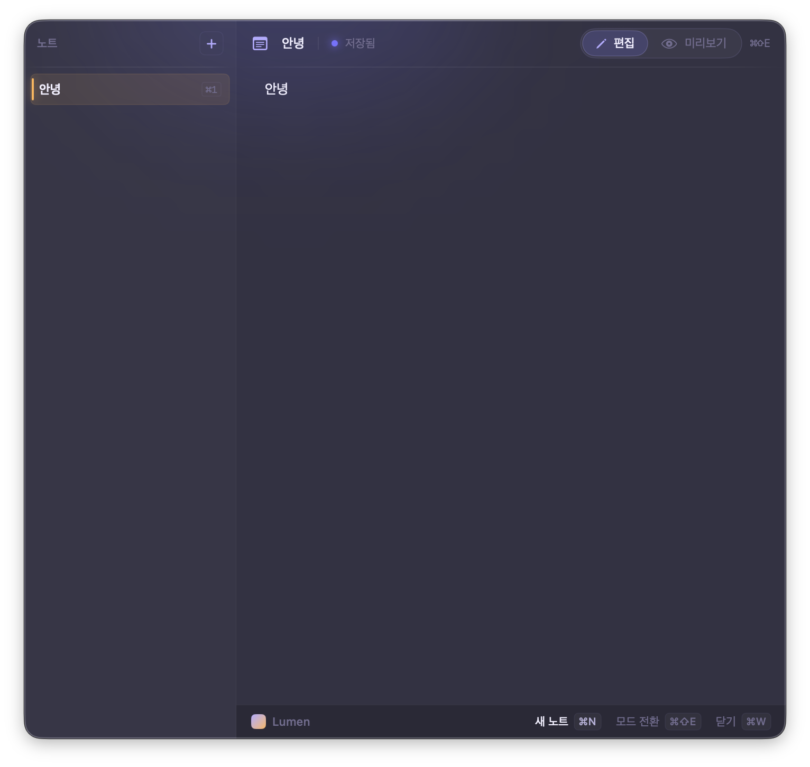
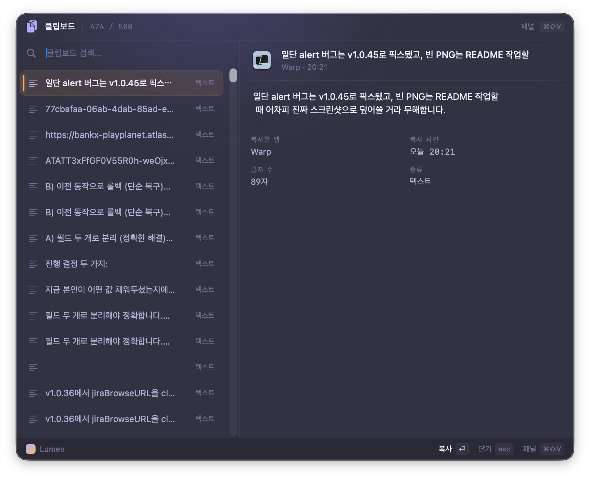
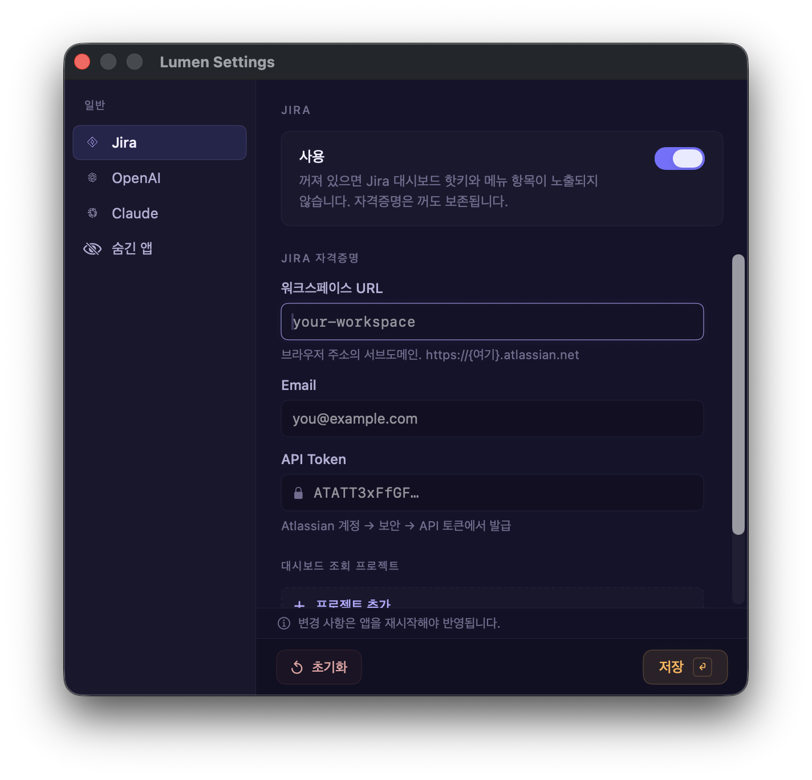

# Lumen

> 메뉴바에서 시작해 메뉴바에서 끝나는, macOS용 개인 런처 + 유틸리티 모음.

[](https://github.com/Hwan3434/Lumen/releases/latest)


Lumen은 **⌘Space**로 떠오르는 한 장짜리 패널에서 앱 실행 · 계산 · 환율 변환 · 번역 · 클립보드 · 메모 · Jira 대시보드를 처리합니다. 작업의 맥락을 끊지 않는 게 핵심 — 패널을 띄우고, 일을 마치고, 사라집니다.

---

## ✨ 화면

### 검색 — `⌘Space`


설치된 앱 빠른 실행, 사칙연산(`5 * (3+2)`), 환율 변환(`100 usd`, `5만원`), 빠른 실행 카드. 우측 사이드 패널은 Claude Code가 설치돼 있을 때 토큰/세션 사용량을 보여줍니다.

### 번역 — `⌘⇧C`



OpenAI 기반 한↔영 번역. 발음 표기 토글, 우측에 최근 번역 30건 히스토리. 입력·결과 모두 *발음 복사*/*결과 복사* 버튼으로 즉시 클립보드.

### 노트 — `⌘⇧X`



마크다운 메모. 좌측 사이드바로 노트 여러 개를 탭처럼 관리합니다. `⌘N` 새 노트, `⌘1`~`⌘9` 탭 이동, `⌘⇧]/[` 다음·이전, `⌘⌫` 삭제, `⌘⇧E` 편집/미리보기 토글. 입력은 1초 디바운스로 자동 저장.

### 클립보드 — `⌘⇧V`



최근 텍스트·이미지 히스토리. 좌측에서 항목 선택 → 우측에서 본문/메타데이터(앱·시간·크기) 확인 → 그대로 복사 또는 붙여넣기.

### 설정 — `⌘,`



자격증명(Jira / OpenAI / Claude)과 숨긴 앱을 한 창에서. 워크스페이스 URL만 넣어주면 Jira Cloud ID는 자동 resolve됩니다. 검색 결과에서 호버 시 나오는 작은 숨기기 버튼으로 가린 앱은 **숨긴 앱** 탭에서 한 번에 되돌리기 가능.

### Jira 대시보드 — `⌘⇧J`

> 스크린샷 추가 예정. 개인이 어사인된 이슈를 *이번 주 / 다음 주 / 기한 초과 / 우선순위 / 스프린트 / 에픽* 관점에서 한 화면에 모아 보여줍니다. status는 Atlassian 표준 카테고리(`new`/`indeterminate`/`done`)로 분류해 한국어/영문 워크스페이스 모두 동작합니다.

---

## 핫키

| 핫키 | 동작 |
|---|---|
| `⌘Space` | 검색 패널 |
| `⌘⇧C` | 번역 |
| `⌘⇧V` | 클립보드 |
| `⌘⇧X` | 노트 (단일 패널 정책 예외 — 다른 패널과 공존) |
| `⌘⇧J` | Jira 대시보드 |
| `⌘⇧M` | 윈도우 마그넷 좌/우 분할 (`⌃⌥←/→`) |
| `⌘,` | Settings |

검색/번역/클립보드/Jira는 한 번에 하나만 떠 있습니다 (single-panel policy). 노트만 다른 패널과 나란히 띄울 수 있어요.

---

## ⚡ 빠른 시작 (사람용)

1. [최신 릴리즈](https://github.com/Hwan3434/Lumen/releases/latest)에서 `Lumen-x.y.z.zip` 다운로드
2. 압축 풀고 `Lumen.app`을 `/Applications`로 이동
3. **첫 실행만** Finder에서 우클릭 → **열기** (self-signed 빌드라 Gatekeeper 통과 1회 필요)
4. 시스템 설정 → **손쉬운 사용** / **입력 모니터링** 에서 Lumen 토글 ON
5. `⌘,` 로 Settings 열어 Jira / OpenAI 자격증명 입력 (해당 기능 쓸 때만)

이후 새 버전은 메뉴바 → "업데이트 확인…" 또는 24시간마다 Sparkle이 자동으로 받습니다.

---

## 외부 의존성

**필수: 없음.** macOS 표준 프레임워크만으로 동작합니다.

기능별 선택 의존:

| 기능 | 필요한 것 |
|---|---|
| 검색 / 클립보드 / 노트 / 윈도우 마그넷 / 카페인 | 없음 |
| 환율 변환 | 인터넷 (open.er-api.com 일 1회 fetch, 캐시로 오프라인 동작) |
| 번역 | OpenAI API 키 |
| Jira 대시보드 | Jira Cloud 워크스페이스 + 이메일 + API 토큰 |
| Claude 사용량 패널 | `~/.claude/projects/` (Claude Code CLI가 만드는 디렉터리) |

---

## 🤖 AI 에이전트용 자동 설치 절차

> Claude/AI 에이전트가 새 macOS에 Lumen을 자율 설치할 수 있도록 명령어와 검증 단계를 명시합니다. **[USER ACTION]** 마커가 있는 단계는 GUI/Touch ID가 필요하므로 사용자에게 위임하세요.

### 0. 사전 요건

```bash
sw_vers -productVersion   # 26.2+ 필요
```

### 1. 옛 버전 / 옛 이름(ClaudeSpot) 정리

```bash
osascript -e 'tell application "Lumen" to quit' 2>/dev/null
osascript -e 'tell application "ClaudeSpot" to quit' 2>/dev/null
sleep 1

[ -d /Applications/Lumen.app ] && rm -rf /Applications/Lumen.app
[ -d /Applications/ClaudeSpot.app ] && rm -rf /Applications/ClaudeSpot.app

tccutil reset All com.jh.Lumen 2>/dev/null
tccutil reset All com.jh.ClaudeSpot 2>/dev/null
```

### 2. 최신 릴리즈 설치

```bash
LATEST=$(gh release view -R Hwan3434/Lumen --json tagName -q .tagName 2>/dev/null \
  || curl -sL https://api.github.com/repos/Hwan3434/Lumen/releases/latest \
     | grep -o '"tag_name": *"[^"]*"' | head -1 | cut -d'"' -f4)
VERSION="${LATEST#v}"

cd /tmp
rm -rf Lumen.app "Lumen-${VERSION}.zip"
curl -sL -o "Lumen-${VERSION}.zip" \
  "https://github.com/Hwan3434/Lumen/releases/download/${LATEST}/Lumen-${VERSION}.zip"
unzip -q "Lumen-${VERSION}.zip"
mv Lumen.app /Applications/
xattr -dr com.apple.quarantine /Applications/Lumen.app 2>/dev/null

INSTALLED=$(/usr/libexec/PlistBuddy -c "Print CFBundleShortVersionString" \
  /Applications/Lumen.app/Contents/Info.plist)
[ "$INSTALLED" = "$VERSION" ] && echo "[OK] $VERSION" || echo "[FAIL] $INSTALLED ≠ $VERSION"
```

### 3. 첫 실행 + 권한 부여 [USER ACTION]

```bash
open -a /Applications/Lumen.app
```

사용자에게 안내:

```bash
open "x-apple.systempreferences:com.apple.preference.security?Privacy_Accessibility"
# 손쉬운 사용 → + → /Applications/Lumen.app → ON

open "x-apple.systempreferences:com.apple.preference.security?Privacy_ListenEvent"
# 입력 모니터링 → + → /Applications/Lumen.app → ON
```

권한 부여 후:

```bash
osascript -e 'tell application "Lumen" to quit'; sleep 1
open -a /Applications/Lumen.app
```

### 4. 자격증명 (선택)

#### 사용자가 GUI로 [USER ACTION]
`⌘,` → Jira / OpenAI 탭에서 입력 → 저장 → 첫 키체인 prompt에서 **항상 허용**.

#### 또는 에이전트가 키체인에 직접 주입
```bash
# Jira — 워크스페이스 slug만 넣으면 cloudId는 첫 fetch에서 자동 resolve됨
security add-generic-password -s com.jh.Lumen -a jiraWorkspaceSlug -w "<your-workspace>" -U
security add-generic-password -s com.jh.Lumen -a jiraEmail         -w "<EMAIL>"          -U
security add-generic-password -s com.jh.Lumen -a jiraApiToken      -w "<TOKEN>"          -U

# OpenAI
security add-generic-password -s com.jh.Lumen -a openAIAPIKey -w "<API_KEY>" -U

# 적용 위해 재시작 (앱은 init 시점에 키를 1회 캐싱)
osascript -e 'tell application "Lumen" to quit'; sleep 1
open -a /Applications/Lumen.app
```

### 5. 검증

```bash
# 실행 중?
pgrep -lf "/Applications/Lumen.app/Contents/MacOS/Lumen" >/dev/null \
  && echo "[OK] running" || echo "[FAIL]"

# 자격증명 저장 여부
for acct in jiraWorkspaceSlug jiraEmail jiraApiToken openAIAPIKey; do
  security find-generic-password -s com.jh.Lumen -a "$acct" >/dev/null 2>&1 \
    && echo "[OK] $acct" || echo "[--] $acct (미설정)"
done
```

### 트러블슈팅

| 증상 | 조치 |
|---|---|
| Gatekeeper "확인되지 않은 개발자" | self-signed 빌드라 정상. Finder 우클릭 → "열기" 1회. |
| 권한 ON인데 핫키 무반응 | TCC DB 잔재. `tccutil reset All com.jh.Lumen` 후 권한 재부여. |
| 키체인 prompt가 매번 뜸 | 옛 fingerprint 잔재. 종료 → `com.jh.Lumen` 항목 키체인에서 삭제 → 재입력. |
| 핫키가 다른 앱에 가로채짐 | 시스템 설정 → 키보드 → 단축키에서 충돌 항목 비활성화. |
| 메뉴바 아이콘 안 보임 | Bartender 등 메뉴바 정리 도구 가능성. 화살표 클릭으로 확장. |

---

## 🛠️ 빌드 & 배포

```sh
./scripts/release.sh 1.2.3   # archive → zip → EdDSA 서명 → appcast → GitHub Release
```

요구사항:
- Xcode (Lumen.xcodeproj 1회 빌드해 SPM 캐시 채워두기)
- `gh` CLI 인증
- macOS Keychain에 코드사이닝 인증서 `Lumen Self-Signed`
- macOS Keychain에 Sparkle EdDSA 비공개키 (`generate_keys` 1회)

---

## 데이터 위치

- **자격증명**: macOS Keychain (`com.jh.Lumen` 서비스)
- **노트**: `~/Library/Application Support/Lumen/notes/<id>.md` (탭마다 1파일)
- **클립보드 / 숨긴 앱 / 환율 캐시**: `~/Library/Application Support/Lumen/`
- **진단 로그**: `~/Library/Logs/Lumen/memory_trace.log`

---

## 스택

Swift · SwiftUI · AppKit · Carbon HotKey · Sparkle 2.x · NetworkImage · swift-markdown-ui. 배포 타깃 macOS 26.2.
